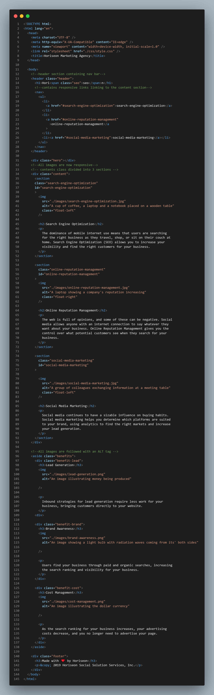

# Marketing-Agency-Refractor

## Overview

For this project my aim was to refactor a website so that it could be more user friendly and is accessible to users equally.

### What did i do?

- Checked all links are responsive.
- Made sure images are apparent if not ive added 'alt' tags to all images.
- Used semantic HTML elements where needed.
- refactored the CSS blocks on styling sheet where possible.

### Technologies used?

- HTML
- CSS

## Screenshots

> final result

> pic of vs code

## Github pages

https://github.com/AsmaaMusse/Marketing-Agency

- Add Deployed homework link
